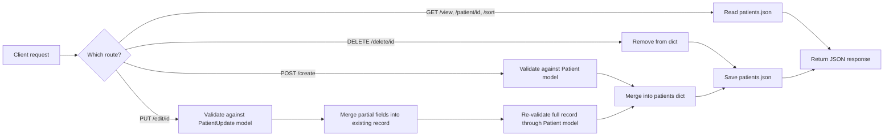

<div align="center">

# Patient Management API

**A FastAPI + Pydantic learning project, built in three progressive stages**


</div>

## TL;DR

| | |
|---|---|
| **What it is** | A file-based (JSON) REST API for managing patient health records |
| **Why 3 stages** | Each folder is a checkpoint from a FastAPI + Pydantic code-along, kept separately to show the API growing from "no validation" to "fully validated CRUD" |
| **Storage** | A single `patients.json` file — no database, by design |
| **Auto-computed** | BMI and a BMI verdict (`Underweight` / `Normal` / `Obese`) are derived server-side, never sent by the client |
| **Endpoints** | Root, about, view all, view one, sort, create, update, delete |
| **Try it** | `uvicorn application:app --reload` inside `stage_3_full_crud/`, then open `/docs` |

## Why three stages instead of one final app?

This started as a code-along with a FastAPI tutorial. Instead of only keeping the final result, the three checkpoints were kept as separate folders because the *diff between them* is the most useful part for anyone learning the same material:

| Stage | File | What it adds | What's still missing |
|---|---|---|---|
| 1 — Basic API | `stage_1_basic_api/main.py` | Plain FastAPI routes reading straight from a JSON file | No validation, no create/update/delete, no computed fields |
| 2 — Pydantic Validation | `stage_2_pydantic_validation/app.py` | A `Patient` Pydantic model (type + range + enum validation), a `create` endpoint, computed `bmi` / `verdict` fields | Still can't update or delete a patient |
| 3 — Full CRUD | `stage_3_full_crud/application.py` | `PatientUpdate` model for partial updates, `edit` and `delete` endpoints | This is the complete version |

If you only want a working API, go straight to `stage_3_full_crud/`. If you're learning FastAPI + Pydantic yourself, reading the three in order shows exactly what each concept buys you.

## How a request flows (Stage 3)



## Project structure

```
fastapi-patient-management-api/
├── stage_1_basic_api/
│   ├── main.py            # Read-only, no validation
│   └── patients.json
├── stage_2_pydantic_validation/
│   ├── app.py              # + Pydantic model, computed fields, create
│   └── patients.json
├── stage_3_full_crud/
│   ├── application.py      # + update, delete  (the complete API)
│   └── patients.json
├── data/
│   └── patients.json        # Reference copy of the seed dataset
├── requirements.txt
├── .gitignore
└── README.md
```

Each stage folder is self-contained and ships its own `patients.json`, so you can `cd` into any one of them and run it without touching the others.

## Getting started

```bash
git clone https://github.com/hamidrazabajwa49/fastapi.git
cd fastapi

python -m venv venv
source venv/bin/activate      # venv\Scripts\activate on Windows

pip install -r requirements.txt

cd stage_3_full_crud
uvicorn application:app --reload
```

Then open **http://127.0.0.1:8000/docs** for the interactive Swagger UI, or use the examples below.

## The `Patient` model

```python
class Patient(BaseModel):
    id: str
    name: str
    age: int              # must be between 1 and 99
    gender: Literal["male", "female", "other"]
    city: str
    height: float          # centimeters
    weight: float           # kilograms

    # Computed automatically — never sent by the client
    bmi: float               # weight / (height_m ** 2), rounded to 2 dp
    verdict: str              # "Underweight" | "Normal" | "Obese"
```

`bmi` and `verdict` are [Pydantic `computed_field`s](https://docs.pydantic.dev/latest/concepts/fields/#the-computed_field-decorator): they're recalculated from `height`/`weight` every time the model is built or serialized, so a client can never send a fake or stale BMI value.

## Endpoint reference (Stage 3 — full CRUD)

| Method | Path | Description |
|---|---|---|
| `GET` | `/` | Welcome message |
| `GET` | `/about` | Short description of the API |
| `GET` | `/view` | Return every patient record |
| `GET` | `/patient/{patient_id}` | Return one patient by ID |
| `GET` | `/sort?sort_by=age&order=desc` | Sort all patients by `age`, `height`, or `weight` |
| `POST` | `/create` | Add a new patient |
| `PUT` | `/edit/{patient_id}` | Partially update an existing patient |
| `DELETE` | `/delete/{patient_id}` | Remove a patient |

### Examples

**Create a patient**

```bash
curl -X POST http://127.0.0.1:8000/create \
  -H "Content-Type: application/json" \
  -d '{
        "id": "P022",
        "name": "Ayesha Khan",
        "age": 27,
        "gender": "female",
        "city": "Lahore",
        "height": 163,
        "weight": 57
      }'
```

**Update just one field**

```bash
curl -X PUT http://127.0.0.1:8000/edit/P022 \
  -H "Content-Type: application/json" \
  -d '{"weight": 60}'
```

**Sort patients by height, descending**

```bash
curl "http://127.0.0.1:8000/sort?sort_by=height&order=desc"
```

**Delete a patient**

```bash
curl -X DELETE http://127.0.0.1:8000/delete/P022
```


## Honest take

This is a learning project, not a production system, and it's worth being upfront about the trade-offs:

- **No database.** Every request reads and rewrites the entire `patients.json` file. This works fine for a handful of records and zero concurrent writers; it will not scale and is not safe against concurrent requests (a real app needs a database + proper transactions).
- **No authentication.** Anyone who can reach the API can create, edit, or delete any patient record.
- **No tests.** The endpoints were verified manually and with a quick smoke test during cleanup, but there's no automated test suite yet — a natural next step.
- **Validation is basic.** Age, gender, and numeric ranges are checked, but there's no validation on `city` (typos, casing) or duplicate-name detection.

The value of this repo is in showing how a plain, unvalidated FastAPI service evolves into a properly validated one as Pydantic models and computed fields are introduced — not in being a production-ready patient records system.

## License

MIT — see [LICENSE](LICENSE).
